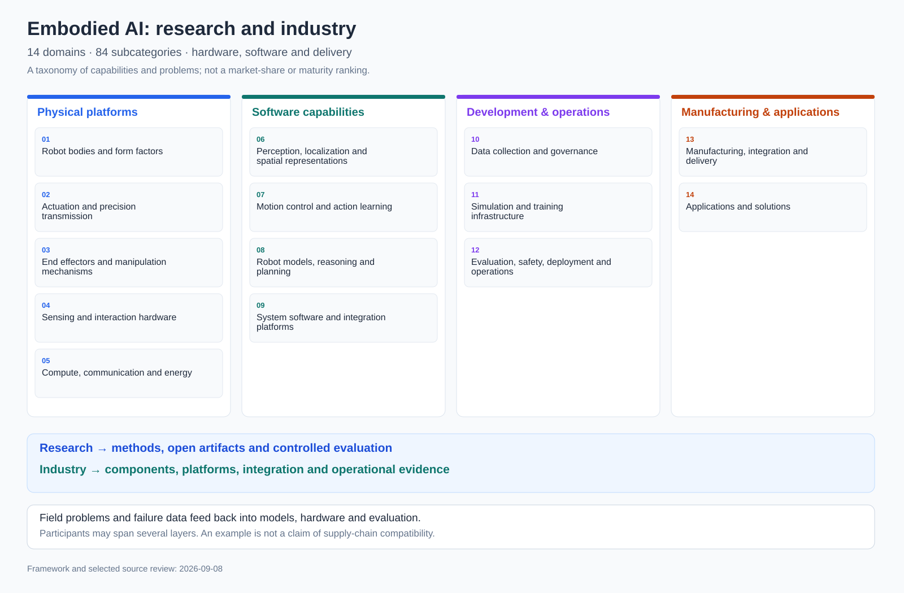

# Research and industry landscape

[Home](../../../README.md) | [中文](../../zh-CN/landscape/README.md) | [Landscape index](README.md)

Start with how embodied systems are built and used, then explore research methods, software and industrial implementations. This editorial framework contains **14 domains and 84 subcategories**. Robotics infrastructure and established automation are included where they support embodied systems; inclusion does not imply use of a foundation model.

[Open full-size diagram](../../../figs/research-industry-landscape.svg)

## Three connected views

1. **Technical structure:** bodies, components, perception, control, models, data, tools and operations.
2. **Participants and deliverables:** academic teams, industrial research, open-source communities, component vendors, integrators and operators may occupy multiple domains.
3. **Evidence and open gaps:** separate demonstrated methods, public resources, documented products and disclosed field cases; inspect what remains unresolved.

## Domains and subcategories

<table width="1630">
<thead>
<tr>
<th width="230" nowrap>Domain</th>
<th width="360">Question</th>
<th width="680">Subcategories</th>
<th width="360">Representative entry points</th>
</tr>
</thead>
<tbody>
<tr>
<td width="230" nowrap><a href="01-bodies.md">Robot bodies and form factors</a></td>
<td width="360">Which body fits a task, balancing reach, mobility, cost and reliability?</td>
<td width="680"><a href="01-bodies.md#01-01">Bipeds and general-purpose humanoids</a> · <a href="01-bodies.md#01-02">Wheeled bimanual mobile manipulators</a> · <a href="01-bodies.md#01-03">Quadrupeds and wheeled-legged robots</a> · <a href="01-bodies.md#01-04">Fixed industrial and collaborative arms</a> · <a href="01-bodies.md#01-05">Small open and educational platforms</a> · <a href="01-bodies.md#01-06">Specialized, soft and wearable bodies</a></td>
<td width="360"><a href="sources.md#source-toddler">ToddlerBot (Stanford University)</a> · <a href="sources.md#source-unitree">Unitree G1</a> · <a href="sources.md#source-franka">Franka Research 3</a></td>
</tr>
<tr>
<td width="230" nowrap><a href="02-actuation.md">Actuation and precision transmission</a></td>
<td width="360">How is electrical energy converted into controllable force and motion under impact, heat and wear?</td>
<td width="680"><a href="02-actuation.md#02-01">Motors and direct drives</a> · <a href="02-actuation.md#02-02">Strain-wave, planetary and cycloidal gearing</a> · <a href="02-actuation.md#02-03">Screws and linear actuators</a> · <a href="02-actuation.md#02-04">Integrated joint modules</a> · <a href="02-actuation.md#02-05">Servo drives and low-level control</a> · <a href="02-actuation.md#02-06">Bearings, brakes and moving connections</a></td>
<td width="360"><a href="sources.md#source-harmonic">Harmonic Drive</a> · <a href="sources.md#source-ti">Texas Instruments robotics design resources</a> · <a href="sources.md#source-toddler">ToddlerBot (Stanford University)</a></td>
</tr>
<tr>
<td width="230" nowrap><a href="03-end-effectors.md">End effectors and manipulation mechanisms</a></td>
<td width="360">How should contact mechanisms be matched to objects and processes beyond adding fingers?</td>
<td width="680"><a href="03-end-effectors.md#03-01">Parallel and adaptive grippers</a> · <a href="03-end-effectors.md#03-02">Suction, pneumatic and soft tools</a> · <a href="03-end-effectors.md#03-03">Multi-finger dexterous hands</a> · <a href="03-end-effectors.md#03-04">Tendon-driven, underactuated and biomimetic mechanisms</a> · <a href="03-end-effectors.md#03-05">Tool changing and process tooling</a> · <a href="03-end-effectors.md#03-06">Bimanual and hand-arm coordination</a></td>
<td width="360"><a href="sources.md#source-leap">LEAP Hand research team</a> · <a href="sources.md#source-shadow">Shadow Robot dexterous hands</a> · <a href="sources.md#source-franka">Franka Research 3</a></td>
</tr>
<tr>
<td width="230" nowrap><a href="04-sensing.md">Sensing and interaction hardware</a></td>
<td width="360">How are environment, body and contact signals measured and aligned?</td>
<td width="680"><a href="04-sensing.md#04-01">Imaging, depth and 3D vision</a> · <a href="04-sensing.md#04-02">LiDAR, radar and ranging</a> · <a href="04-sensing.md#04-03">Inertial, encoder and proprioceptive sensing</a> · <a href="04-sensing.md#04-04">Force/torque and joint-torque sensing</a> · <a href="04-sensing.md#04-05">Tactile arrays and electronic skin</a> · <a href="04-sensing.md#04-06">Motion capture, speech and human interfaces</a></td>
<td width="360"><a href="sources.md#source-digit">GelSight DIGIT</a> · <a href="sources.md#source-ati">ATI force/torque sensors</a> · <a href="sources.md#source-unitree">Unitree G1</a></td>
</tr>
<tr>
<td width="230" nowrap><a href="05-compute.md">Compute, communication and energy</a></td>
<td width="360">How can high-compute inference coexist with deterministic control on one robot?</td>
<td width="680"><a href="05-compute.md#05-01">Inference chips and heterogeneous acceleration</a> · <a href="05-compute.md#05-02">Edge computers and domain controllers</a> · <a href="05-compute.md#05-03">Real-time microcontrollers and power drives</a> · <a href="05-compute.md#05-04">On-robot buses and industrial networks</a> · <a href="05-compute.md#05-05">Wireless, cloud-edge and remote connectivity</a> · <a href="05-compute.md#05-06">Batteries, power conversion and thermal management</a></td>
<td width="360"><a href="sources.md#source-nvidia">NVIDIA robotics platform</a> · <a href="sources.md#source-ti">Texas Instruments robotics design resources</a> · <a href="sources.md#source-toddler">ToddlerBot (Stanford University)</a></td>
</tr>
<tr>
<td width="230" nowrap><a href="06-perception.md">Perception, localization and spatial representations</a></td>
<td width="360">How are sensor streams converted into states usable by navigation, planning and manipulation?</td>
<td width="680"><a href="06-perception.md#06-01">Object recognition and open-vocabulary perception</a> · <a href="06-perception.md#06-02">Pose, geometry and affordances</a> · <a href="06-perception.md#06-03">Localization, mapping and state estimation</a> · <a href="06-perception.md#06-04">3D reconstruction and scene representations</a> · <a href="06-perception.md#06-05">Semantic maps and spatial memory</a> · <a href="06-perception.md#06-06">Active perception and uncertainty</a></td>
<td width="360"><a href="sources.md#source-nav2">Nav2 community</a> · <a href="sources.md#source-rvt">RVT research team</a> · <a href="sources.md#source-voxposer">VoxPoser research team</a></td>
</tr>
<tr>
<td width="230" nowrap><a href="07-control.md">Motion control and action learning</a></td>
<td width="360">How are task goals converted into continuous, stable and dynamically feasible actions?</td>
<td width="680"><a href="07-control.md#07-01">Kinematics and trajectory planning</a> · <a href="07-control.md#07-02">Model predictive and optimal control</a> · <a href="07-control.md#07-03">Force, impedance and contact control</a> · <a href="07-control.md#07-04">Legged and whole-body coordination</a> · <a href="07-control.md#07-05">Imitation, diffusion and flow policies</a> · <a href="07-control.md#07-06">Reinforcement learning and online adaptation</a></td>
<td width="360"><a href="sources.md#source-moveit">MoveIt / PickNik</a> · <a href="sources.md#source-control">ros2_control community</a> · <a href="sources.md#source-diffusion">Diffusion Policy research team</a></td>
</tr>
<tr>
<td width="230" nowrap><a href="08-models.md">Robot models, reasoning and planning</a></td>
<td width="360">How are language understanding, world prediction, skills and execution feedback connected?</td>
<td width="680"><a href="08-models.md#08-01">Vision-language-action foundation models</a> · <a href="08-models.md#08-02">World models and action consequence prediction</a> · <a href="08-models.md#08-03">Task decomposition and skill planning</a> · <a href="08-models.md#08-04">Long-term memory and personalization</a> · <a href="08-models.md#08-05">Failure monitoring and recovery</a> · <a href="08-models.md#08-06">Hierarchical agents and hybrid systems</a></td>
<td width="360"><a href="sources.md#source-openvla">OpenVLA research collaboration</a> · <a href="sources.md#source-pi">Physical Intelligence / pi0</a> · <a href="sources.md#source-saycan">SayCan research team</a></td>
</tr>
<tr>
<td width="230" nowrap><a href="09-systems.md">System software and integration platforms</a></td>
<td width="360">How are heterogeneous devices, models and skills composed into a developable and debuggable system?</td>
<td width="680"><a href="09-systems.md#09-01">Operating systems and communication middleware</a> · <a href="09-systems.md#09-02">Drivers, hardware abstraction and control interfaces</a> · <a href="09-systems.md#09-03">Navigation and manipulation stacks</a> · <a href="09-systems.md#09-04">Skill libraries, behavior trees and workflows</a> · <a href="09-systems.md#09-05">Development, debugging and observability</a> · <a href="09-systems.md#09-06">Facility integration and multi-robot coordination</a></td>
<td width="360"><a href="sources.md#source-ros">ROS 2 community</a> · <a href="sources.md#source-control">ros2_control community</a> · <a href="sources.md#source-moveit">MoveIt / PickNik</a></td>
</tr>
<tr>
<td width="230" nowrap><a href="10-data.md">Data collection and governance</a></td>
<td width="360">How are demonstrations and operational experience turned into reusable, traceable data assets?</td>
<td width="680"><a href="10-data.md#10-01">Teleoperation and demonstration capture</a> · <a href="10-data.md#10-02">Human video and cross-body retargeting</a> · <a href="10-data.md#10-03">Autonomous exploration and failure collection</a> · <a href="10-data.md#10-04">Multimodal synchronization and annotation</a> · <a href="10-data.md#10-05">Cleaning, versions and data quality</a> · <a href="10-data.md#10-06">Formats, sharing and data feedback loops</a></td>
<td width="360"><a href="sources.md#source-oxe">Open X-Embodiment collaboration</a> · <a href="sources.md#source-droid">DROID multi-institution team</a> · <a href="sources.md#source-umi">UMI research team</a></td>
</tr>
<tr>
<td width="230" nowrap><a href="11-simulation.md">Simulation and training infrastructure</a></td>
<td width="360">How can controlled experiments accelerate development while exposing what simulation cannot replace?</td>
<td width="680"><a href="11-simulation.md#11-01">Physics engines and contact solving</a> · <a href="11-simulation.md#11-02">Digital twins and asset construction</a> · <a href="11-simulation.md#11-03">Sensor simulation and synthetic data</a> · <a href="11-simulation.md#11-04">Parallel training and experiment management</a> · <a href="11-simulation.md#11-05">Domain randomization and transfer</a> · <a href="11-simulation.md#11-06">Software- and hardware-in-the-loop validation</a></td>
<td width="360"><a href="sources.md#source-mujoco">MuJoCo / Google DeepMind</a> · <a href="sources.md#source-isaac">NVIDIA Isaac Lab</a> · <a href="sources.md#source-robotwin">RoboTwin collaboration</a></td>
</tr>
<tr>
<td width="230" nowrap><a href="12-operations.md">Evaluation, safety, deployment and operations</a></td>
<td width="360">How is single-task performance turned into measurable, recoverable and sustained system capability?</td>
<td width="680"><a href="12-operations.md#12-01">Capability benchmarks and task evaluation</a> · <a href="12-operations.md#12-02">Reliability and long-horizon testing</a> · <a href="12-operations.md#12-03">Safety constraints and system protection</a> · <a href="12-operations.md#12-04">Edge deployment and model updates</a> · <a href="12-operations.md#12-05">Takeover, diagnostics and recovery</a> · <a href="12-operations.md#12-06">Fleet, service and operational metrics</a></td>
<td width="360"><a href="sources.md#source-nist">NIST</a> · <a href="sources.md#source-robotwin">RoboTwin collaboration</a> · <a href="sources.md#source-rmf">Open-RMF community</a></td>
</tr>
<tr>
<td width="230" nowrap><a href="13-manufacturing.md">Manufacturing, integration and delivery</a></td>
<td width="360">How can prototypes become manufacturable, serviceable deliverables with explicit configurations?</td>
<td width="680"><a href="13-manufacturing.md#13-01">Structural materials and precision manufacturing</a> · <a href="13-manufacturing.md#13-02">Additive manufacturing and rapid iteration</a> · <a href="13-manufacturing.md#13-03">Assembly, calibration and factory tests</a> · <a href="13-manufacturing.md#13-04">Supply chain and configuration management</a> · <a href="13-manufacturing.md#13-05">System integration and workstation adaptation</a> · <a href="13-manufacturing.md#13-06">Service, training and lifecycle support</a></td>
<td width="360"><a href="sources.md#source-protolabs">Protolabs</a> · <a href="sources.md#source-harmonic">Harmonic Drive</a> · <a href="sources.md#source-toddler">ToddlerBot (Stanford University)</a></td>
</tr>
<tr>
<td width="230" nowrap><a href="14-applications.md">Applications and solutions</a></td>
<td width="360">Which workflows do robots serve, and how is value measured through real tasks?</td>
<td width="680"><a href="14-applications.md#14-01">Manufacturing, assembly and process work</a> · <a href="14-applications.md#14-02">Warehousing, logistics and delivery</a> · <a href="14-applications.md#14-03">Commercial services and building operations</a> · <a href="14-applications.md#14-04">Home, consumer and companion robots</a> · <a href="14-applications.md#14-05">Energy, agriculture and specialized field work</a> · <a href="14-applications.md#14-06">Medical, rehabilitation and assistive robotics</a></td>
<td width="360"><a href="sources.md#source-ur">Universal Robots</a> · <a href="sources.md#source-gxo">GXO / Agility Robotics</a> · <a href="sources.md#source-nist">NIST</a></td>
</tr>
</tbody>
</table>

## Connections across the system

<table width="1400">
<thead>
<tr>
<th width="300" nowrap>System question</th>
<th width="1100">Connected domains</th>
</tr>
</thead>
<tbody>
<tr>
<td width="300" nowrap>Contact-rich manipulation</td>
<td width="1100"><a href="03-end-effectors.md">End effectors and manipulation mechanisms</a> → <a href="04-sensing.md">Sensing and interaction hardware</a> → <a href="07-control.md">Motion control and action learning</a> → <a href="10-data.md">Data collection and governance</a> → <a href="12-operations.md">Evaluation, safety, deployment and operations</a></td>
</tr>
<tr>
<td width="300" nowrap>Long-horizon mobile work</td>
<td width="1100"><a href="01-bodies.md">Robot bodies and form factors</a> → <a href="06-perception.md">Perception, localization and spatial representations</a> → <a href="08-models.md">Robot models, reasoning and planning</a> → <a href="09-systems.md">System software and integration platforms</a> → <a href="12-operations.md">Evaluation, safety, deployment and operations</a></td>
</tr>
<tr>
<td width="300" nowrap>Train-to-deploy loop</td>
<td width="1100"><a href="10-data.md">Data collection and governance</a> → <a href="11-simulation.md">Simulation and training infrastructure</a> → <a href="08-models.md">Robot models, reasoning and planning</a> → <a href="05-compute.md">Compute, communication and energy</a> → <a href="12-operations.md">Evaluation, safety, deployment and operations</a></td>
</tr>
<tr>
<td width="300" nowrap>Prototype-to-delivery loop</td>
<td width="1100"><a href="01-bodies.md">Robot bodies and form factors</a> → <a href="02-actuation.md">Actuation and precision transmission</a> → <a href="13-manufacturing.md">Manufacturing, integration and delivery</a> → <a href="14-applications.md">Applications and solutions</a> → <a href="12-operations.md">Evaluation, safety, deployment and operations</a></td>
</tr>
</tbody>
</table>

Follow [progress and bottlenecks](progress.md), [evidence rules and sources](sources.md), or return to the [research-method map](../overview.md).
