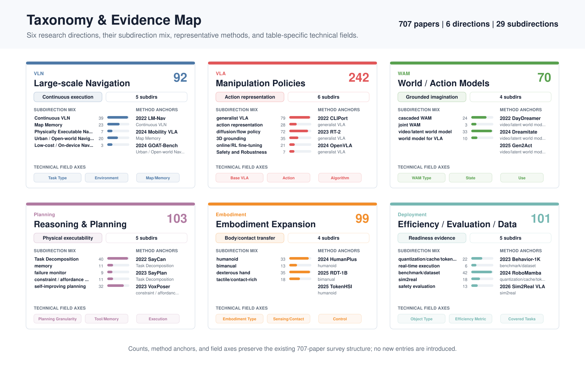
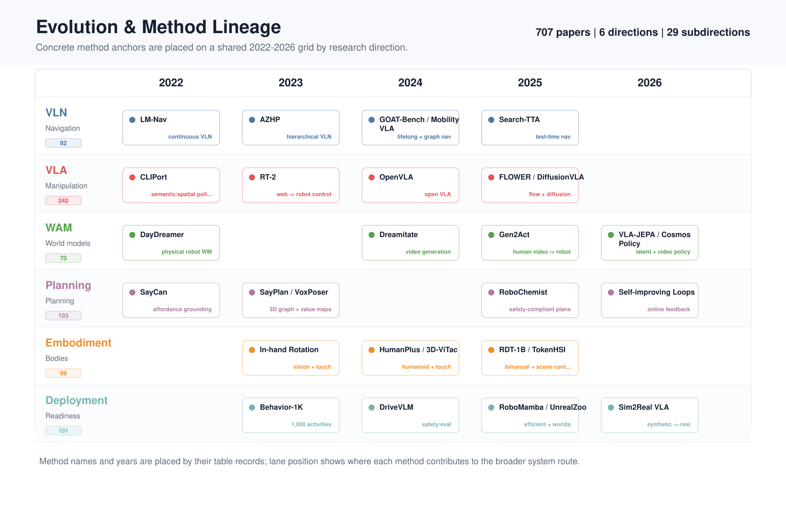
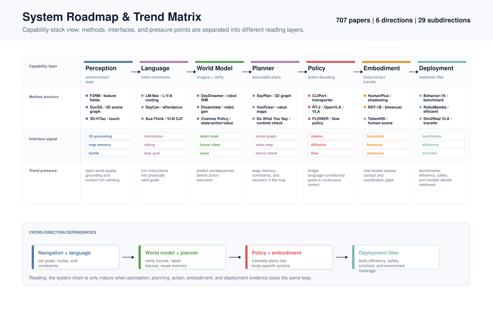
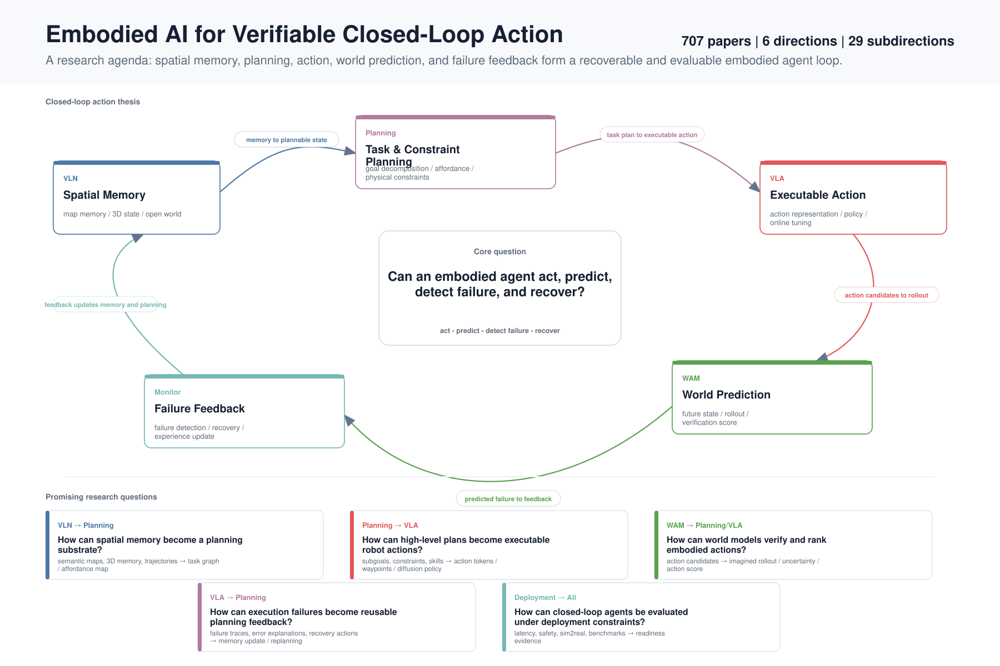

# Overall View

[Home](../../README.md) | [中文](../zh-CN/overview.md)

> Historical figures below retain the earlier 707-entry snapshot. The current main tables contain **767 categorized entries** across 29 subdirections; these are row counts, not a deduplicated paper count. The 7 additional source entries are separate.

The current embodied AI frontier can be grouped into six tracks: large-scale VLN, VLA manipulation policies, WAM/world models, agentic planning, embodiment expansion, and deployment-oriented efficiency/evaluation/data.

The system direction worth tracking is:

```text
task understanding and fine-grained planning agent
        -> WAM / world model for imagination, verification, and failure prediction
        -> small VLA, diffusion policy, skill library, or classical controller
        -> local robot safety loop
```

The reason is straightforward: monolithic VLA models matter, but real robots also need interpretable planning, executable constraints, low-latency control, failure recovery, and on-device autonomy.

## Taxonomy & Evidence Map

<p align="center">
  
</p>

## Evolution & Method Lineage

<p align="center">
  
</p>

## System Roadmap & Trend Matrix

<p align="center">
  
</p>

## Research Direction: Verifiable Closed-Loop Action

The next research thread worth highlighting is not a single module, but a closed loop: spatial memory supports planning, planning grounds executable action, world models verify consequences, and failure feedback updates the next plan.

<p align="center">
  
</p>

<table width="920">
<thead>
<tr>
<th width="240">Direction</th>
<th width="680">Trend</th>
</tr>
</thead>
<tbody>
<tr>
<td width="240">VLN</td>
<td width="680">VLN is moving from discrete graph navigation toward continuous, memory-backed, physically executable, open-world navigation, while on-device variants are still early.</td>
</tr>
<tr>
<td width="240">VLA</td>
<td width="680">VLA growth is led by generalist policies and diffusion/flow action generation, with action representation, 3D grounding, online tuning, and safety becoming the practical bottlenecks.</td>
</tr>
<tr>
<td width="240">WAM</td>
<td width="680">WAM is emerging as an imagination and verification layer between planning and controllers, with cascaded and video/latent models ahead of fully joint world-action modeling.</td>
</tr>
<tr>
<td width="240">Planning</td>
<td width="680">Agentic planning is moving from instruction decomposition toward memory, failure monitoring, executable constraints, and self-improving loops.</td>
</tr>
<tr>
<td width="240">Embodiment</td>
<td width="680">Embodiment expansion tests whether policies survive new bodies, contacts, and coordination demands, with humanoid and dexterous-hand work leading the volume.</td>
</tr>
<tr>
<td width="240">Deployment</td>
<td width="680">Deployment work is led by benchmark/data credibility, efficiency, and sim2real transfer, with real-time execution and safety evaluation as smaller but necessary readiness checks.</td>
</tr>
</tbody>
</table>

<table width="1200">
<thead>
<tr>
<th width="240">Direction</th>
<th width="280">Subdirection</th>
<th width="680">Trend</th>
</tr>
</thead>
<tbody>
<tr>
<td width="240">VLN</td>
<td width="280">Continuous VLN</td>
<td width="680">Continuous observations, multimodal goals, and online adaptation are replacing the clean discrete-graph assumption.</td>
</tr>
<tr>
<td width="240">VLN</td>
<td width="280">Map Memory</td>
<td width="680">Semantic maps, topological memory, 3D memory, retrieval, and caching are becoming the navigation substrate.</td>
</tr>
<tr>
<td width="240">VLN</td>
<td width="280">Physically Executable Navigation</td>
<td width="680">Navigation research is adding body constraints, dynamic scenes, and safety decoding so plans can be executed.</td>
</tr>
<tr>
<td width="240">VLN</td>
<td width="280">Urban / Open-world Navigation</td>
<td width="680">The setting is expanding toward streets, crowds, implicit human needs, lifelong navigation, and open-world exploration.</td>
</tr>
<tr>
<td width="240">VLN</td>
<td width="280">Low-cost / On-device Navigation</td>
<td width="680">The deployment track compresses navigation into smaller memories, cheaper data, and on-device inference.</td>
</tr>
<tr>
<td width="240">VLA</td>
<td width="280">generalist VLA</td>
<td width="680">Generalist policies consolidate many tasks and datasets into reusable robot foundation policies.</td>
</tr>
<tr>
<td width="240">VLA</td>
<td width="280">action representation</td>
<td width="680">Action tokens, waypoints, constraints, and motion primitives bridge language/image understanding with executable control.</td>
</tr>
<tr>
<td width="240">VLA</td>
<td width="280">diffusion/flow policy</td>
<td width="680">Diffusion and flow models are becoming a major action-generation route for robust manipulation.</td>
</tr>
<tr>
<td width="240">VLA</td>
<td width="280">3D grounding</td>
<td width="680">Object-centric geometry, spatial localization, and affordance priors are moving VLA from pixels toward physical scenes.</td>
</tr>
<tr>
<td width="240">VLA</td>
<td width="280">online/RL fine-tuning</td>
<td width="680">Post-pretraining adaptation uses RL, online feedback, and test-time optimization to close execution gaps.</td>
</tr>
<tr>
<td width="240">VLA</td>
<td width="280">Safety and Robustness</td>
<td width="680">Robustness work is shifting from benchmark accuracy to attacks, uncertainty, unsafe actions, and physical failure modes.</td>
</tr>
<tr>
<td width="240">WAM</td>
<td width="280">cascaded WAM</td>
<td width="680">Cascaded systems imagine or predict first, then act, making WAM easier to attach to existing planners and controllers.</td>
</tr>
<tr>
<td width="240">WAM</td>
<td width="280">joint WAM</td>
<td width="680">Joint WAM is small but important because it tries to model vision, state, and action in one coupled system.</td>
</tr>
<tr>
<td width="240">WAM</td>
<td width="280">video/latent world model</td>
<td width="680">Video and latent prediction are the main path for future-state imagination, reward shaping, and interactive simulation.</td>
</tr>
<tr>
<td width="240">WAM</td>
<td width="280">world model for VLA</td>
<td width="680">World models are being used to improve VLA generalization, action selection, and failure recovery.</td>
</tr>
<tr>
<td width="240">Planning</td>
<td width="280">Task Decomposition</td>
<td width="680">Planners translate high-level language into subgoals, programs, skills, or executable task graphs.</td>
</tr>
<tr>
<td width="240">Planning</td>
<td width="280">memory</td>
<td width="680">Persistent scene, task, and personalization memory supports long-horizon interaction beyond a single episode.</td>
</tr>
<tr>
<td width="240">Planning</td>
<td width="280">failure monitor</td>
<td width="680">Failure monitors make embodied agents detect, explain, and recover from execution errors instead of assuming success.</td>
</tr>
<tr>
<td width="240">Planning</td>
<td width="280">constraint / affordance planning</td>
<td width="680">Constraints, affordances, PDDL-like structure, and code policies make high-level plans physically executable.</td>
</tr>
<tr>
<td width="240">Planning</td>
<td width="280">self-improving planning</td>
<td width="680">Feedback, RL, reflection, and experience revision are turning planning into an iterative improvement loop.</td>
</tr>
<tr>
<td width="240">Embodiment</td>
<td width="280">humanoid</td>
<td width="680">Humanoid work stresses whole-body control, mobile manipulation, sim2real transfer, and generalization across full-body skills.</td>
</tr>
<tr>
<td width="240">Embodiment</td>
<td width="280">bimanual</td>
<td width="680">Bimanual research focuses on coordinated dual-arm manipulation and longer-horizon interaction.</td>
</tr>
<tr>
<td width="240">Embodiment</td>
<td width="280">dexterous hand</td>
<td width="680">Dexterous-hand work expands grasping and manipulation into high-DOF action spaces and transfer-heavy settings.</td>
</tr>
<tr>
<td width="240">Embodiment</td>
<td width="280">tactile/contact-rich</td>
<td width="680">Tactile and contact-rich research brings force, touch, and fine-grained feedback into manipulation policies.</td>
</tr>
<tr>
<td width="240">Deployment</td>
<td width="280">quantization/cache/tokenization</td>
<td width="680">Efficiency work compresses models and action representations through quantization, caching, and tokenization.</td>
</tr>
<tr>
<td width="240">Deployment</td>
<td width="280">real-time execution</td>
<td width="680">Real-time execution focuses on latency-aware control and edge deployment constraints.</td>
</tr>
<tr>
<td width="240">Deployment</td>
<td width="280">benchmark/dataset</td>
<td width="680">Benchmarks and datasets define coverage, credibility, and whether progress is measurable across robots and tasks.</td>
</tr>
<tr>
<td width="240">Deployment</td>
<td width="280">sim2real</td>
<td width="680">Sim2real work bridges generated/simulated assets, dynamics, and policies into physical robot execution.</td>
</tr>
<tr>
<td width="240">Deployment</td>
<td width="280">safety evaluation</td>
<td width="680">Safety evaluation builds tests for physical risk, robustness, and alignment under embodied interaction.</td>
</tr>
</tbody>
</table>

## Direction Overview

<table width="1340">
<thead>
<tr>
<th width="110" nowrap>Tag</th>
<th width="240">Direction</th>
<th width="280">Subdirection</th>
<th width="90" nowrap>Entries</th>
<th width="620">Takeaway</th>
</tr>
</thead>
<tbody>
<tr>
<td width="110" nowrap><code>VLN</code></td>
<td width="240">VLN / Large-scale Navigation</td>
<td width="280">continuous VLN, map memory, physically executable navigation, urban/open-world navigation, low-cost/on-device navigation</td>
<td width="90" nowrap>92</td>
<td width="620">VLN focuses on language goals, spatial maps, memory, exploration, and navigation decisions. The core problem is turning natural-language tasks into executable large-scale movement plans. Current survey entries show a shift from discrete navigation graphs toward continuous environments, physically executable navigation, open urban settings, and lower-cost on-device navigation.</td>
</tr>
<tr>
<td width="110" nowrap><code>VLA</code></td>
<td width="240">VLA / Manipulation Policies</td>
<td width="280">generalist VLA, action representation, diffusion/flow policy, 3D grounding, online/RL fine-tuning, safety/robustness</td>
<td width="90" nowrap>251</td>
<td width="620">VLA is the main track for robotic arms and mobile manipulation, but it is not just an action head attached to a large model. Survey papers concentrate on action representation, diffusion/flow policies, 3D grounding, online/RL fine-tuning, and robustness.</td>
</tr>
<tr>
<td width="110" nowrap><code>WAM</code></td>
<td width="240">WAM / World Models</td>
<td width="280">cascaded WAM, joint WAM, video/latent world model, world model for VLA</td>
<td width="90" nowrap>70</td>
<td width="620">WAM combines future world-state prediction with action generation and fits naturally between agent planning and low-level control. Its value is not replacing every controller, but providing an intermediate layer for imagination, verification, and recovery.</td>
</tr>
<tr>
<td width="110" nowrap><code>Planning</code></td>
<td width="240">Agentic Planning / Reasoning and Planning</td>
<td width="280">task decomposition, memory, failure monitor, constraint / affordance planning, self-improving planning</td>
<td width="90" nowrap>103</td>
<td width="620">This direction emphasizes task decomposition, memory, failure monitoring, constraint/affordance planning, and self-improving planning. It is closest to the practical system route of agent planning plus smaller execution modules.</td>
</tr>
<tr>
<td width="110" nowrap><code>Embodiment</code></td>
<td width="240">Embodiment Expansion / Dexterous Manipulation</td>
<td width="280">humanoid, bimanual, dexterous hand, tactile/contact-rich</td>
<td width="90" nowrap>146</td>
<td width="620">Embodiment expansion determines whether embodied AI can move beyond single-arm systems toward humanoids, bimanual robots, dexterous hands, and tactile/contact-rich tasks. These papers show how action spaces, sensing, and control objectives become more complex as the body changes.</td>
</tr>
<tr>
<td width="110" nowrap><code>Deployment</code></td>
<td width="240">Efficiency / Evaluation / Data</td>
<td width="280">quantization/cache/tokenization, real-time execution, benchmark/dataset, sim2real, safety evaluation</td>
<td width="90" nowrap>105</td>
<td width="620">This direction determines whether systems can actually be deployed: on-device inference, caching/quantization/action tokenization, real-time execution, sim2real, benchmarks, and safety evaluation are all necessary conditions.</td>
</tr>
</tbody>
</table>
