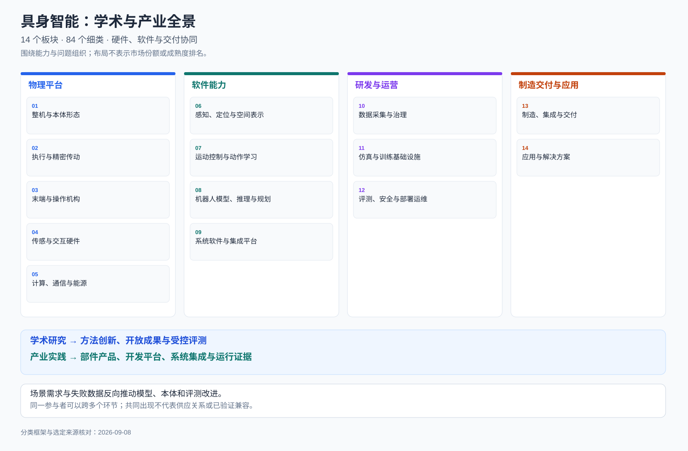

# 学术与产业全景

[首页](../../../README.zh-CN.md) | [英文](../../en/landscape/README.md) | [全景目录](README.md)

先理解具身系统如何组成和使用，再进入研究方法、软件与产业实现。本版编辑框架包含 **14 个板块、84 个细类**。与具身系统相关的机器人基础设施和既有自动化也纳入视野；纳入某类不代表其使用基础模型。

[查看全景大图](../../../figs/research-industry-landscape.zh-CN.svg)

## 三个相互关联的视角

1. **技术结构：** 本体、部件、感知、控制、模型、数据、工具与运营共同构成系统。
2. **参与者与交付物：** 高校团队、企业研究、开源社区、部件商、集成商和运营方可以跨多个板块。
3. **证据与瓶颈：** 区分方法演示、公开资源、产品资料和现场案例，进一步查看仍未解决的问题。

## 板块与细类

<table width="1630">
<thead>
<tr>
<th width="230" nowrap>板块</th>
<th width="360">核心问题</th>
<th width="680">细类</th>
<th width="360">代表性入口</th>
</tr>
</thead>
<tbody>
<tr>
<td width="230" nowrap><a href="01-bodies.md">整机与本体形态</a></td>
<td width="360">什么身体适合什么任务，如何平衡可达空间、运动能力、成本与可靠性？</td>
<td width="680"><a href="01-bodies.md#01-01">双足与通用人形</a> · <a href="01-bodies.md#01-02">轮式双臂与移动操作</a> · <a href="01-bodies.md#01-03">四足与轮足</a> · <a href="01-bodies.md#01-04">固定工业与协作机械臂</a> · <a href="01-bodies.md#01-05">小型开放与教学平台</a> · <a href="01-bodies.md#01-06">专用、柔性与可穿戴本体</a></td>
<td width="360"><a href="sources.md#source-toddler">ToddlerBot（斯坦福大学）</a> · <a href="sources.md#source-unitree">宇树 G1</a> · <a href="sources.md#source-franka">Franka Research 3</a></td>
</tr>
<tr>
<td width="230" nowrap><a href="02-actuation.md">执行与精密传动</a></td>
<td width="360">怎样把电能变成可控的力与运动，并在冲击、温升和磨损下保持性能？</td>
<td width="680"><a href="02-actuation.md#02-01">电机与直接驱动</a> · <a href="02-actuation.md#02-02">谐波、行星与摆线减速</a> · <a href="02-actuation.md#02-03">丝杠与线性执行器</a> · <a href="02-actuation.md#02-04">一体化关节模组</a> · <a href="02-actuation.md#02-05">伺服驱动与底层控制</a> · <a href="02-actuation.md#02-06">支承、制动与运动连接</a></td>
<td width="360"><a href="sources.md#source-harmonic">Harmonic Drive</a> · <a href="sources.md#source-ti">德州仪器机器人设计资源</a> · <a href="sources.md#source-toddler">ToddlerBot（斯坦福大学）</a></td>
</tr>
<tr>
<td width="230" nowrap><a href="03-end-effectors.md">末端与操作机构</a></td>
<td width="360">如何根据物体与工艺选择接触方式，而非只增加手指数量？</td>
<td width="680"><a href="03-end-effectors.md#03-01">平行与自适应夹爪</a> · <a href="03-end-effectors.md#03-02">吸附、气动与柔性末端</a> · <a href="03-end-effectors.md#03-03">多指灵巧手</a> · <a href="03-end-effectors.md#03-04">绳驱、欠驱动与仿生结构</a> · <a href="03-end-effectors.md#03-05">工具快换与工艺末端</a> · <a href="03-end-effectors.md#03-06">双手与手臂协同</a></td>
<td width="360"><a href="sources.md#source-leap">LEAP Hand 研究团队</a> · <a href="sources.md#source-shadow">Shadow Robot 灵巧手</a> · <a href="sources.md#source-franka">Franka Research 3</a></td>
</tr>
<tr>
<td width="230" nowrap><a href="04-sensing.md">传感与交互硬件</a></td>
<td width="360">如何测量外部环境、身体状态与接触过程，并把多种信号对齐？</td>
<td width="680"><a href="04-sensing.md#04-01">图像、深度与三维视觉</a> · <a href="04-sensing.md#04-02">激光、雷达与测距</a> · <a href="04-sensing.md#04-03">惯性、编码器与本体反馈</a> · <a href="04-sensing.md#04-04">六维力与关节力矩</a> · <a href="04-sensing.md#04-05">触觉阵列与电子皮肤</a> · <a href="04-sensing.md#04-06">动作捕捉、语音与人机交互</a></td>
<td width="360"><a href="sources.md#source-digit">GelSight DIGIT</a> · <a href="sources.md#source-ati">ATI 六维力传感器</a> · <a href="sources.md#source-unitree">宇树 G1</a></td>
</tr>
<tr>
<td width="230" nowrap><a href="05-compute.md">计算、通信与能源</a></td>
<td width="360">怎样把高算力推理与确定性控制放进同一台机器人？</td>
<td width="680"><a href="05-compute.md#05-01">推理芯片与异构加速</a> · <a href="05-compute.md#05-02">边缘计算与域控制器</a> · <a href="05-compute.md#05-03">实时微控制与功率驱动</a> · <a href="05-compute.md#05-04">机内总线与工业网络</a> · <a href="05-compute.md#05-05">无线、云边与远程连接</a> · <a href="05-compute.md#05-06">电池、电源与热管理</a></td>
<td width="360"><a href="sources.md#source-nvidia">NVIDIA 机器人平台</a> · <a href="sources.md#source-ti">德州仪器机器人设计资源</a> · <a href="sources.md#source-toddler">ToddlerBot（斯坦福大学）</a></td>
</tr>
<tr>
<td width="230" nowrap><a href="06-perception.md">感知、定位与空间表示</a></td>
<td width="360">怎样把传感数据转换为可供导航、规划和操作使用的状态？</td>
<td width="680"><a href="06-perception.md#06-01">目标识别与开放词汇感知</a> · <a href="06-perception.md#06-02">位姿、几何与可供性</a> · <a href="06-perception.md#06-03">定位建图与状态估计</a> · <a href="06-perception.md#06-04">三维重建与场景表征</a> · <a href="06-perception.md#06-05">语义地图与空间记忆</a> · <a href="06-perception.md#06-06">主动感知与不确定性</a></td>
<td width="360"><a href="sources.md#source-nav2">Nav2 社区</a> · <a href="sources.md#source-rvt">RVT 研究团队</a> · <a href="sources.md#source-voxposer">VoxPoser 研究团队</a></td>
</tr>
<tr>
<td width="230" nowrap><a href="07-control.md">运动控制与动作学习</a></td>
<td width="360">如何把任务目标转成连续、稳定且符合动力学的动作？</td>
<td width="680"><a href="07-control.md#07-01">运动学与轨迹规划</a> · <a href="07-control.md#07-02">模型预测与最优控制</a> · <a href="07-control.md#07-03">力控、阻抗与接触控制</a> · <a href="07-control.md#07-04">腿式与全身协调控制</a> · <a href="07-control.md#07-05">模仿与扩散、流动作策略</a> · <a href="07-control.md#07-06">强化学习与在线适应</a></td>
<td width="360"><a href="sources.md#source-moveit">MoveIt / PickNik</a> · <a href="sources.md#source-control">ros2_control 社区</a> · <a href="sources.md#source-diffusion">Diffusion Policy 研究团队</a></td>
</tr>
<tr>
<td width="230" nowrap><a href="08-models.md">机器人模型、推理与规划</a></td>
<td width="360">怎样连接语言理解、世界预测、技能与执行反馈？</td>
<td width="680"><a href="08-models.md#08-01">视觉语言动作基础模型</a> · <a href="08-models.md#08-02">世界模型与行动后果预测</a> · <a href="08-models.md#08-03">任务分解与技能规划</a> · <a href="08-models.md#08-04">长期记忆与个性化</a> · <a href="08-models.md#08-05">失败监测与恢复</a> · <a href="08-models.md#08-06">分层智能体与混合系统</a></td>
<td width="360"><a href="sources.md#source-openvla">OpenVLA 联合研究团队</a> · <a href="sources.md#source-pi">Physical Intelligence / π0</a> · <a href="sources.md#source-saycan">SayCan 研究团队</a></td>
</tr>
<tr>
<td width="230" nowrap><a href="09-systems.md">系统软件与集成平台</a></td>
<td width="360">如何把异构设备、模型和技能组成可开发、可调试的机器人系统？</td>
<td width="680"><a href="09-systems.md#09-01">操作系统与通信中间件</a> · <a href="09-systems.md#09-02">驱动、硬件抽象与控制接口</a> · <a href="09-systems.md#09-03">导航与操作软件栈</a> · <a href="09-systems.md#09-04">技能库、行为树与工作流</a> · <a href="09-systems.md#09-05">开发、调试与可观测性</a> · <a href="09-systems.md#09-06">设施对接与多机协调</a></td>
<td width="360"><a href="sources.md#source-ros">ROS 2 社区</a> · <a href="sources.md#source-control">ros2_control 社区</a> · <a href="sources.md#source-moveit">MoveIt / PickNik</a></td>
</tr>
<tr>
<td width="230" nowrap><a href="10-data.md">数据采集与治理</a></td>
<td width="360">怎样把分散的演示与运行经验变成可复用、可追溯的数据资产？</td>
<td width="680"><a href="10-data.md#10-01">遥操作与示范采集</a> · <a href="10-data.md#10-02">人类视频与跨本体重定向</a> · <a href="10-data.md#10-03">自动探索与失败采集</a> · <a href="10-data.md#10-04">多模态同步与标注</a> · <a href="10-data.md#10-05">清洗、版本与数据质量</a> · <a href="10-data.md#10-06">数据格式、共享与数据闭环</a></td>
<td width="360"><a href="sources.md#source-oxe">Open X-Embodiment 协作组</a> · <a href="sources.md#source-droid">DROID 多机构团队</a> · <a href="sources.md#source-umi">UMI 研究团队</a></td>
</tr>
<tr>
<td width="230" nowrap><a href="11-simulation.md">仿真与训练基础设施</a></td>
<td width="360">如何用可控实验加速研发，同时识别仿真无法替代的真实因素？</td>
<td width="680"><a href="11-simulation.md#11-01">物理引擎与接触求解</a> · <a href="11-simulation.md#11-02">数字孪生与资产构建</a> · <a href="11-simulation.md#11-03">传感仿真与合成数据</a> · <a href="11-simulation.md#11-04">并行训练与实验管理</a> · <a href="11-simulation.md#11-05">领域随机化与迁移</a> · <a href="11-simulation.md#11-06">软件、硬件在环验证</a></td>
<td width="360"><a href="sources.md#source-mujoco">MuJoCo / Google DeepMind</a> · <a href="sources.md#source-isaac">NVIDIA Isaac Lab</a> · <a href="sources.md#source-robotwin">RoboTwin 联合团队</a></td>
</tr>
<tr>
<td width="230" nowrap><a href="12-operations.md">评测、安全与部署运维</a></td>
<td width="360">怎样把单次任务效果转化为可测、可恢复、可持续运行的系统能力？</td>
<td width="680"><a href="12-operations.md#12-01">能力基准与任务评测</a> · <a href="12-operations.md#12-02">可靠性与长时程测试</a> · <a href="12-operations.md#12-03">安全约束与系统防护</a> · <a href="12-operations.md#12-04">端侧部署与模型更新</a> · <a href="12-operations.md#12-05">接管、诊断与恢复</a> · <a href="12-operations.md#12-06">机队、服务与运营指标</a></td>
<td width="360"><a href="sources.md#source-nist">美国国家标准与技术研究院</a> · <a href="sources.md#source-robotwin">RoboTwin 联合团队</a> · <a href="sources.md#source-rmf">Open-RMF 社区</a></td>
</tr>
<tr>
<td width="230" nowrap><a href="13-manufacturing.md">制造、集成与交付</a></td>
<td width="360">怎样把实验样机变成可制造、可维护且配置明确的交付物？</td>
<td width="680"><a href="13-manufacturing.md#13-01">结构材料与精密制造</a> · <a href="13-manufacturing.md#13-02">增材制造与快速迭代</a> · <a href="13-manufacturing.md#13-03">装配、标定与出厂测试</a> · <a href="13-manufacturing.md#13-04">供应链与配置管理</a> · <a href="13-manufacturing.md#13-05">系统集成与工位改造</a> · <a href="13-manufacturing.md#13-06">维护、培训与生命周期</a></td>
<td width="360"><a href="sources.md#source-protolabs">Protolabs</a> · <a href="sources.md#source-harmonic">Harmonic Drive</a> · <a href="sources.md#source-toddler">ToddlerBot（斯坦福大学）</a></td>
</tr>
<tr>
<td width="230" nowrap><a href="14-applications.md">应用与解决方案</a></td>
<td width="360">机器人服务于哪些工作流程，价值如何通过真实任务衡量？</td>
<td width="680"><a href="14-applications.md#14-01">制造、装配与工艺操作</a> · <a href="14-applications.md#14-02">仓储物流与搬运配送</a> · <a href="14-applications.md#14-03">商业服务与楼宇作业</a> · <a href="14-applications.md#14-04">家庭消费与陪伴</a> · <a href="14-applications.md#14-05">能源、农业与特种作业</a> · <a href="14-applications.md#14-06">医疗、康复与辅助行动</a></td>
<td width="360"><a href="sources.md#source-ur">Universal Robots</a> · <a href="sources.md#source-gxo">GXO / Agility Robotics</a> · <a href="sources.md#source-nist">美国国家标准与技术研究院</a></td>
</tr>
</tbody>
</table>

## 跨环节联系

<table width="1400">
<thead>
<tr>
<th width="300" nowrap>系统问题</th>
<th width="1100">关联环节</th>
</tr>
</thead>
<tbody>
<tr>
<td width="300" nowrap>接触丰富操作</td>
<td width="1100"><a href="03-end-effectors.md">末端与操作机构</a> → <a href="04-sensing.md">传感与交互硬件</a> → <a href="07-control.md">运动控制与动作学习</a> → <a href="10-data.md">数据采集与治理</a> → <a href="12-operations.md">评测、安全与部署运维</a></td>
</tr>
<tr>
<td width="300" nowrap>长时程移动作业</td>
<td width="1100"><a href="01-bodies.md">整机与本体形态</a> → <a href="06-perception.md">感知、定位与空间表示</a> → <a href="08-models.md">机器人模型、推理与规划</a> → <a href="09-systems.md">系统软件与集成平台</a> → <a href="12-operations.md">评测、安全与部署运维</a></td>
</tr>
<tr>
<td width="300" nowrap>训练到部署闭环</td>
<td width="1100"><a href="10-data.md">数据采集与治理</a> → <a href="11-simulation.md">仿真与训练基础设施</a> → <a href="08-models.md">机器人模型、推理与规划</a> → <a href="05-compute.md">计算、通信与能源</a> → <a href="12-operations.md">评测、安全与部署运维</a></td>
</tr>
<tr>
<td width="300" nowrap>样机到交付闭环</td>
<td width="1100"><a href="01-bodies.md">整机与本体形态</a> → <a href="02-actuation.md">执行与精密传动</a> → <a href="13-manufacturing.md">制造、集成与交付</a> → <a href="14-applications.md">应用与解决方案</a> → <a href="12-operations.md">评测、安全与部署运维</a></td>
</tr>
</tbody>
</table>

继续阅读[关键进展与共性瓶颈](progress.md)、[证据规则与来源](sources.md)，或进入[研究方法地图](../overview.md)。
