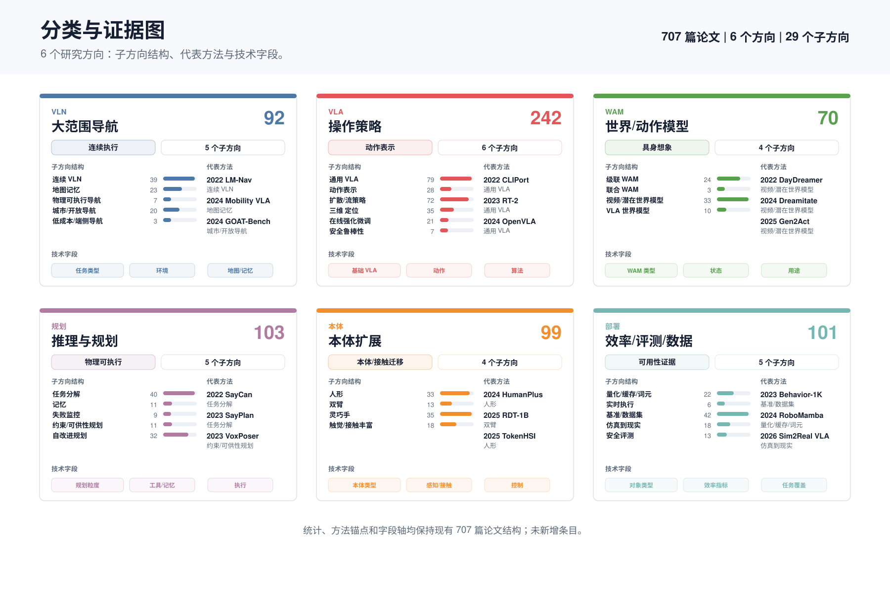
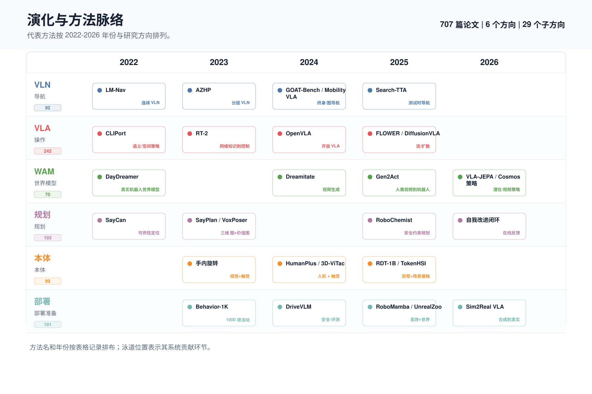
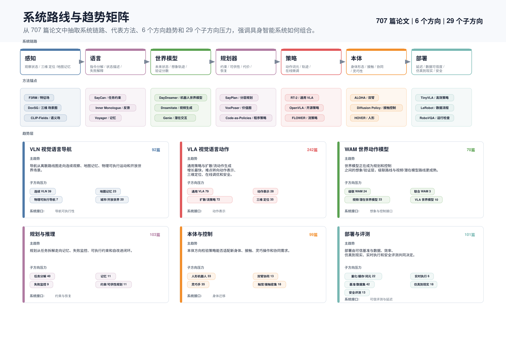
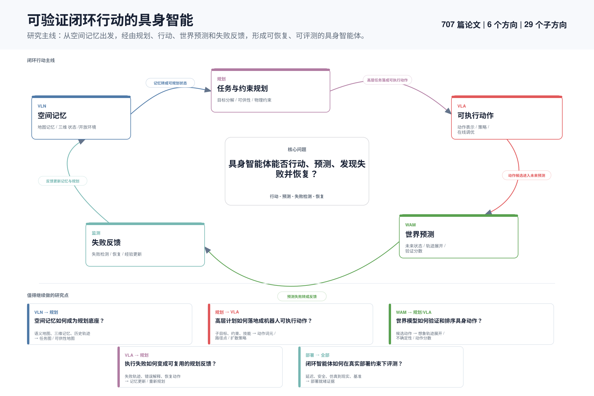

# 总体判断

[首页](../../README.zh-CN.md) | [英文](../en/overview.md)

> 下列图示保留早期 707 条的历史快照。当前主表为 29 个子方向、**767 条分类条目**；按表格行计数，不代表跨方向去重后的论文数。另有 7 条源仓库补充条目，单独列示。

当前具身智能的热点可以分成六条线：VLN 大范围导航、VLA 操作策略、WAM 世界动作模型、智能体推理规划、本体扩展/灵巧操作、轻量化/评测/数据。

最值得持续跟踪的系统路线是：

```text
任务理解与细粒度规划 智能体
        -> WAM / 世界模型 做想象、验证和失败预测
        -> 小 VLA、扩散策略、技能库或传统控制执行
        -> 机器人本地安全闭环
```

原因很直接：单体 VLA 仍然重要，但真实机器人需要可解释规划、可执行约束、低延迟控制、失败恢复和端侧自治。

## 分类与证据图

<p align="center">
  
</p>

## 演化与方法脉络

<p align="center">
  
</p>

## 系统路线图与趋势矩阵

<p align="center">
  
</p>

## 研究主线：可验证闭环行动

下一步更值得强调的研究主线不是单个模块，而是一个闭环：空间记忆支撑规划，规划落地为可执行动作，世界模型验证行动后果，失败反馈再更新下一轮规划。

<p align="center">
  
</p>

<table width="920">
<thead>
<tr>
<th width="240">方向</th>
<th width="680">趋势</th>
</tr>
</thead>
<tbody>
<tr>
<td width="240">VLN</td>
<td width="680">VLN 正在从离散导航图走向连续观察、地图记忆、物理可执行和开放世界导航，端侧低成本方向还处在较早阶段。</td>
</tr>
<tr>
<td width="240">VLA</td>
<td width="680">VLA 的主体增量来自通用策略和扩散/流动作生成，真正的瓶颈转向动作表示、三维空间落地、在线调优和安全鲁棒性。</td>
</tr>
<tr>
<td width="240">WAM</td>
<td width="680">WAM 正在成为规划和控制之间的想象与验证层，其中级联和视频/潜在世界模型比完全联合的路线更成熟。</td>
</tr>
<tr>
<td width="240">规划</td>
<td width="680">智能体规划从任务拆解进一步走向记忆、失败监控、可执行约束和自改进闭环。</td>
</tr>
<tr>
<td width="240">本体扩展</td>
<td width="680">本体扩展在检验策略能否适应不同身体、接触和协调需求，其中人形机器人和灵巧手的论文量最高。</td>
</tr>
<tr>
<td width="240">部署</td>
<td width="680">部署方向以基准/数据可信度、效率和仿真到现实为主，实时执行和安全评测规模较小但决定可用性。</td>
</tr>
</tbody>
</table>

<table width="1200">
<thead>
<tr>
<th width="240">方向</th>
<th width="280">小方向</th>
<th width="680">趋势</th>
</tr>
</thead>
<tbody>
<tr>
<td width="240">VLN</td>
<td width="280">连续环境 VLN</td>
<td width="680">连续观察、多模态目标和在线适应正在替代干净的离散导航图假设。</td>
</tr>
<tr>
<td width="240">VLN</td>
<td width="280">地图记忆</td>
<td width="680">语义地图、拓扑记忆、三维记忆、检索和缓存正在成为导航决策的底座。</td>
</tr>
<tr>
<td width="240">VLN</td>
<td width="280">物理可执行导航</td>
<td width="680">研究正在加入本体约束、动态场景和安全解码，让导航计划能真实执行。</td>
</tr>
<tr>
<td width="240">VLN</td>
<td width="280">城市/开放环境导航</td>
<td width="680">场景扩展到街道、人群、隐式人类需求、终身导航和开放世界探索。</td>
</tr>
<tr>
<td width="240">VLN</td>
<td width="280">低成本/端侧导航</td>
<td width="680">部署线索集中在小内存、低数据成本和端侧推理。</td>
</tr>
<tr>
<td width="240">VLA</td>
<td width="280">通用 VLA</td>
<td width="680">通用策略把多任务、多数据源整合成可复用的机器人基础策略。</td>
</tr>
<tr>
<td width="240">VLA</td>
<td width="280">动作表示</td>
<td width="680">动作词元、路径点、约束和运动基元连接语言/图像理解与可执行控制。</td>
</tr>
<tr>
<td width="240">VLA</td>
<td width="280">扩散与流策略</td>
<td width="680">扩散和流正在成为鲁棒操作动作生成的重要路线。</td>
</tr>
<tr>
<td width="240">VLA</td>
<td width="280">三维空间落地</td>
<td width="680">物体中心几何、空间定位和可供性先验推动 VLA 从像素走向物理场景。</td>
</tr>
<tr>
<td width="240">VLA</td>
<td width="280">在线/强化学习微调</td>
<td width="680">预训练后的强化学习、在线反馈和测试时优化用于弥合真实执行差距。</td>
</tr>
<tr>
<td width="240">VLA</td>
<td width="280">安全鲁棒性</td>
<td width="680">鲁棒性研究从基准分数转向攻击、不确定性、不安全动作和物理失败模式。</td>
</tr>
<tr>
<td width="240">WAM</td>
<td width="280">级联世界动作模型</td>
<td width="680">级联路线先想象或预测再行动，最容易接到现有规划器和控制器上。</td>
</tr>
<tr>
<td width="240">WAM</td>
<td width="280">联合世界动作模型</td>
<td width="680">联合世界动作模型数量少但重要，因为它试图统一建模视觉、状态和动作。</td>
</tr>
<tr>
<td width="240">WAM</td>
<td width="280">视频/潜在世界模型</td>
<td width="680">视频/潜在预测是未来状态想象、奖励塑造和交互式仿真的主路径。</td>
</tr>
<tr>
<td width="240">WAM</td>
<td width="280">面向 VLA 的世界模型</td>
<td width="680">世界模型正在用于提升 VLA 泛化、动作选择和失败恢复。</td>
</tr>
<tr>
<td width="240">规划</td>
<td width="280">任务分解</td>
<td width="680">规划器把高层语言转成子目标、程序、技能或可执行任务图。</td>
</tr>
<tr>
<td width="240">规划</td>
<td width="280">记忆</td>
<td width="680">持久场景记忆、任务记忆和个性化记忆支撑跨回合的长程交互。</td>
</tr>
<tr>
<td width="240">规划</td>
<td width="280">失败监测</td>
<td width="680">失败监测让智能体能发现、解释和恢复执行错误，而不是默认执行成功。</td>
</tr>
<tr>
<td width="240">规划</td>
<td width="280">约束 / 可供性规划</td>
<td width="680">约束、可供性、类似 PDDL 的结构和代码策略让高层计划更可执行。</td>
</tr>
<tr>
<td width="240">规划</td>
<td width="280">自我改进规划</td>
<td width="680">反馈、强化学习、反思和经验修订正在把规划变成迭代自改进闭环。</td>
</tr>
<tr>
<td width="240">本体扩展</td>
<td width="280">人形机器人</td>
<td width="680">人形机器人方向强调全身控制、移动操作、仿真到现实和跨全身技能泛化。</td>
</tr>
<tr>
<td width="240">本体扩展</td>
<td width="280">双臂操作</td>
<td width="680">双臂操作研究集中在双臂协同和更长程的交互操作。</td>
</tr>
<tr>
<td width="240">本体扩展</td>
<td width="280">灵巧手</td>
<td width="680">灵巧手把抓取和操作扩展到高自由度动作空间和强迁移场景。</td>
</tr>
<tr>
<td width="240">本体扩展</td>
<td width="280">触觉/接触丰富操作</td>
<td width="680">触觉和接触丰富任务把力、触觉和细粒度反馈引入操作策略。</td>
</tr>
<tr>
<td width="240">部署</td>
<td width="280">量化/缓存/词元化</td>
<td width="680">效率方向通过量化、缓存和词元化压缩模型与动作表示。</td>
</tr>
<tr>
<td width="240">部署</td>
<td width="280">实时执行</td>
<td width="680">实时执行关注低延迟控制和边缘部署约束。</td>
</tr>
<tr>
<td width="240">部署</td>
<td width="280">基准/数据集</td>
<td width="680">基准和数据集决定覆盖范围、评测可信度和跨机器人/任务的可比性。</td>
</tr>
<tr>
<td width="240">部署</td>
<td width="280">仿真到现实</td>
<td width="680">仿真到现实连接生成/仿真资产、动力学和策略到真实机器人执行。</td>
</tr>
<tr>
<td width="240">部署</td>
<td width="280">安全评测</td>
<td width="680">安全评测构建面向物理风险、鲁棒性和具身交互对齐的测试。</td>
</tr>
</tbody>
</table>

## 方向总览表

<table width="1340">
<thead>
<tr>
<th width="110" nowrap>标签</th>
<th width="240">方向</th>
<th width="280">子方向</th>
<th width="90" nowrap>条目数</th>
<th width="620">结果判断</th>
</tr>
</thead>
<tbody>
<tr>
<td width="110" nowrap><code>VLN</code></td>
<td width="240">VLN / 大范围导航</td>
<td width="280">连续环境 VLN、地图记忆、物理可执行导航、城市/开放环境导航、低成本/端侧导航</td>
<td width="90" nowrap>92</td>
<td width="620">VLN 关注语言目标、空间地图、记忆、探索和导航决策，核心问题是把自然语言任务变成可执行的大范围移动计划。当前调研条目显示，研究正在从离散导航图转向连续环境、物理可执行导航、开放城市环境和低成本端侧导航。</td>
</tr>
<tr>
<td width="110" nowrap><code>VLA</code></td>
<td width="240">VLA / 操作策略</td>
<td width="280">通用 VLA、动作表示、扩散与流策略、三维空间落地、在线/强化学习微调、安全鲁棒性</td>
<td width="90" nowrap>251</td>
<td width="620">VLA 是机械臂和移动操作的主战场，但它不只是“大模型接动作头”。调研论文集中在动作表示、扩散与流策略、三维空间落地、在线/强化学习微调和安全鲁棒性上。</td>
</tr>
<tr>
<td width="110" nowrap><code>WAM</code></td>
<td width="240">WAM / 世界模型</td>
<td width="280">级联世界动作模型、联合世界动作模型、视频/潜在世界模型、面向 VLA 的世界模型</td>
<td width="90" nowrap>70</td>
<td width="620">WAM 将未来世界状态预测和动作生成合在一起，适合放在智能体规划和低层控制之间。它的价值不是替代所有控制器，而是提供可想象、可验证、可恢复的中间层。</td>
</tr>
<tr>
<td width="110" nowrap><code>规划</code></td>
<td width="240">智能体规划 / 推理规划</td>
<td width="280">任务分解、记忆、失败监测、约束 / 可供性规划、自我改进规划</td>
<td width="90" nowrap>103</td>
<td width="620">这一方向强调任务分解、记忆、失败监控、约束/可供性规划和自改进规划。它最贴近“智能体规划，小模型或传统方法执行”的系统路线。</td>
</tr>
<tr>
<td width="110" nowrap><code>本体扩展</code></td>
<td width="240">本体扩展 / 灵巧操作</td>
<td width="280">人形机器人、双臂操作、灵巧手、触觉与接触丰富操作</td>
<td width="90" nowrap>146</td>
<td width="620">本体扩展决定具身智能是否能从单机械臂走向人形、双臂、灵巧手和触觉接触任务。表中论文体现了动作空间、传感方式和控制目标随本体变化而复杂化。</td>
</tr>
<tr>
<td width="110" nowrap><code>部署</code></td>
<td width="240">轻量化 / 评测 / 数据</td>
<td width="280">量化/缓存/词元化、实时执行、基准/数据集、仿真到现实、安全评测</td>
<td width="90" nowrap>105</td>
<td width="620">这一方向决定能不能真实部署：端侧推理、缓存/量化/动作词元化、实时执行、仿真到现实、基准和安全评测都是必需条件。</td>
</tr>
</tbody>
</table>
